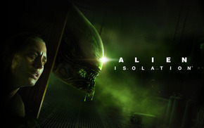
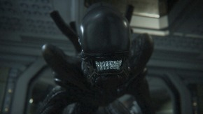

# Alien: Isolation

## General Information
*Alien: Isolation* is a 2014 first-person survival horror stealth game developed by **Creative Assembly** and published by [**Sega**](https://www.sega.com/). It is based on the *Alien* film franchise and focuses on survival against a relentless alien creature.  

| Platform | Release Date |
|----------|--------------|
| Microsoft Windows, PlayStation 3, PlayStation 4, Xbox 360, Xbox One | October 7, 2014 |
| Nintendo Switch | December 5, 2019 |
| iOS, Android | December 16, 2021 |

## Gameplay
You play as **Amanda Ripley**, daughter of Ellen Ripley, as she explores the Sevastopol space station to uncover the fate of her mother.  

* The main threat is the **Xenomorph**, an intelligent alien that cannot be killed.  
* Players must use stealth: hide in lockers, crouch under tables, and use distractions like noisemakers.  
* Hostile humans and androids ("Working Joes") also patrol the station.  
* Tools include a **motion tracker**, crafting system, and a flamethrower (later in the game) to temporarily repel the alien.  
* The design emphasizes tension, limited resources, and survival rather than combat.\

## Plot
Amanda Ripley learns the Nostromo’s flight recorder has been recovered and travels to **Sevastopol Station**. Upon arrival, she finds the station in ruins, with survivors hostile, androids malfunctioning, and a **Xenomorph** hunting everyone.  

Amanda discovers Seegson Corporation’s attempts to exploit the alien. The infestation grows uncontrollable, and she fights to eject the Xenomorph into space. The game closes with Amanda drifting in space, ending on an ambiguous note as she sees a bright light from an unknown ship. 

