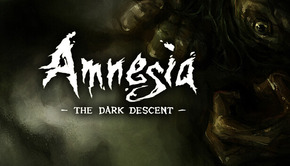
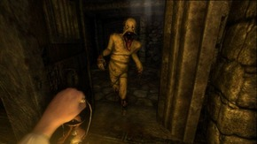

# Amnesia: The Dark Descent

## General Information
*Amnesia: The Dark Descent* is a 2010 first-person survival horror adventure game developed and published by **Frictional Games**. It is renowned for its psychological horror and is considered one of the most influential indie horror games.  

| Platform | Release Date |
|----------|--------------|
| Microsoft Windows, MacOS, Linux | September 8, 2010 |
| PlayStation 4 | November 22, 2016 |
| Xbox One | September 28, 2018 |
| Nintendo Switch | September 12, 2019 |

## Gameplay
You play as **Daniel**, who awakens inside Castle Brennenburg with no memory of how he got there.  

- There is **no combat**; survival depends on hiding and running from monsters.  
- Daniel’s **sanity** decreases when he stays in darkness or witnesses unsettling events, causing hallucinations.  
- Light sources (torches, candles, oil lamps) help preserve sanity, but resources are limited.  
- Exploration, puzzle-solving, and reading notes drive the story forward.  

## Plot
Daniel regains his memories while exploring **Castle Brennenburg**:  

He worked for **Alexander of Brennenburg**, helping capture and torture innocents for dark rituals. Overcome with guilt, Daniel drank an amnesia potion to forget his past deeds.  Alexander’s ultimate goal is to open a portal to another dimension. Multiple endings exist depending on the player’s choices: Daniel may destroy Alexander, sacrifice himself, or let Alexander succeed.  

## More games
[* Amnesia: A Machine for Pigs](https://aamfp.com/)
[* Amnesia: Rebirth](https://amnesiarebirth.com/)
[* Amnesia: The Bunker](https://amnesiathebunker.com/)
