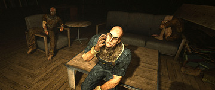

# Outlast

## General Information 
[*Outlasts*](https://redbarrelsgames.com/games/outlast/) is a 2013 first-person psychological survival horror and jumpscare video game developed and published by [Red Red Barrels](https://redbarrelsgames.com/).
| Platform      | Release Date |
| ----------- | ----------- |
| Microsoft Windows  | September 4, 2013 |
| PlayStation 4      | February 4, 2014 |
| Xbox One   | June 18th, 2014 |

## Gameplay 
You play as investigative journalist Miles Upshur, who investigates a remote asylum called Mount Massive Asylum after receiving an anonymous tip about unethical experiments conducted by the Murkoff Corporation.\
\
[*Learn more about Mount Massive Assylum*](https://outlast.fandom.com/wiki/Mount_Massive_Asylum)

In order to survive, the player must either run or hide from enemies. Combat is not possible and attempts to confront an enemy will result in death. Players can hide in lockers and under beds. However, enemies will look for them in these areas, so care must be taken. When running, the player can look back at their pursuer.

The only item players will have equipped is a camcorder. The camcorder is battery operated and includes night vision, which is used to navigate through dark areas. Having the camcorder on helps to record events and put notes in the player's notebook. Batteries need to be collected throughout the game to keep the camcorder's night vision working. The story unravels through documents that can be found in various locations. They appear as blue folders with **"CONFIDENTIAL"** stamped on the front.

## Plot 
Miles Upshur discovers the asylum's patients, called Variants, have been subjected to experiments that turned them into homicidal maniacs, and he becomes pursued by them. Miles learns of a supernatural entity known as The Walrider, a swarm of nanites controlled by the host Billy Hope. Miles stops Billy's life support, and the Walrider fuses with him. Miles is then killed by armed soldiers, but the Walrider resurrects in Miles, killing the soldiers as the game ends.  

## 
* [Outlas: Whistleblower](https://redbarrelsgames.com/games/outlast-whistleblower/)
* [Outlast 2](https://redbarrelsgames.com/games/outlast-2/)
* [The Outlast Trials](https://redbarrelsgames.com/games/the-outlast-trials/)

Go to the main page of horror games [here](https://github.com/319SoftDev/wiki-project-group-row-2/blob/main/videogame/horror/horrorfile.md)

